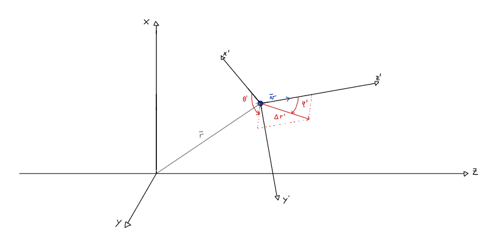

# Electron Beam Simulation

This code simulates an electron beam as detailed in: _Angulo D., Saenz W., Murillo M, “Simulación de la trayectoria de un haz de electrones en un sólido usando el método de Monte Carlo”, (2016)_. The code is implemented in Fortran and allows for a double layer system.

## Input

All input parameters must be specified in the 'input.nml' file, though default values are used if not specified. An example is provided in [input.nml](./input.nml). Said input contains three sections:
- _&physical_ - specifies the physically relevant information in the system
- _&calculation_ - specifies the calculation's parameters
- _&tasks_ - specifies the additional tasks (only _track_trajectories_ currently available)


### _&physical_ parameters
- _bulk_material_ - specifies the bulk material (default: 'C')
- _ray_tilt_ - specifies the incident angle of the electron beam (default: 0)
- _E_min_ - specifies the minimum energy (in KeV) to be considered (default: 0.5)
- _E_max_ - specifies the initial electron's energy (in KeV, default: 30)
- _covering_ - specifies whether a covering material is to be used (default: .false.)
- _surface_material_ - specifies the covering material (default: 'Au')
- _covering_thickness_ - specifies the thickness of the covering material (default: 2e-6)

### _&calculation_ parameters
- _Num_electrons_ - specifies the number of electrons to be considered (default: 1000)
- _Num_trajectories_ - specifies the number of individual electron's trajectories to be saved (will be discounted from _Num_electrons_). _track_trajectories_ must be set to .true. in the _&tasks_ section for this parameter to be considered.
- _BSE_tol_ - specifies the tolerance in the z-coordinate of Backsacterred Electrons (BSE). Must be greater than 0 if backscattered electron's trajectories are to be saved (default: 0).

## Program logic
The main program goes through a simple loop in the number of electrons:
- Initialization: initialize all relevant physical and computational details
- Random Step: make a random step
- Update variables: position and energy
- Check conditions: if the energy is beneath the minimum threshold or the z-coordinate is beyond the one specified by _BSE_tol_ the calculation for that electron stops (adding 1 to the number of BSE if the second condition was satisfied).

The only calculations are done in the Random Step and detailed next.

### Random Step
In order to choose a random step, three variables must be specified. In spherical coordinates these are: step length ($r$), azimuthal scattering angle ($\theta$) and polar scattering angle ($\varphi$). The step length is given by $−\lambda ln(RND)$. The polar scattering angle is sampled from a uniform distribution $\mathcal{U}(0,2\pi)$. The azimuthal scattering angle is determined by: $cos(\varphi) = 1 −
\frac{2αRND}{1 + α − RND}$. The constants $\lambda$ and $\alpha$ depend on the materials chosen.

In order to take into account the electron's current position and velocity, we select the random step in its coordinate system, such that its velocity (last random step direction) is aligned with the $z'$ coordinate axis. Then, using direction cosines and well Rodrigues' rotation formula (in spherical coordinates) we rotate it back to the original frame of reference and update the coordinates (avoiding matrix multiplication). A sketch of the idea is presented below.



The rotaion employed is given by:
```math
    \frac{\Delta \vec{r'}}{|\Delta \vec{r'}|}
    =
    \cos(\varphi')
    \frac{\vec{v}}{|\vec{v}|}
    +
    \sin(\varphi')
    (\vec{u_1} + \vec{u_2})
```
Where:
- $\frac{\vec{v}}{|\vec{v}|}$ is the previous random step unit vector (i.e. the direction of the electron's velocity) in the unprimed coordinate system.
- $\frac{\Delta \vec{r'}}{|\Delta \vec{r'}|}$ is the current random step direction  in the unprimed coordinate system.
- $\theta'$ is the azimuthal angle in the primed coordinate system.
- $\varphi'$ is the polar (scattering) angle in the primed coordinate system.
- $\vec{u_2}, \vec{u_2}$ are unit vectors perpendicular to each other and to \frac{\vec{v}}{|\vec{v}|}, forming a right-hand basis.

In our specific implementation we select $\hat{z}' = \frac{\vec{v}}{|\vec{v}|} = (c_x,c_y,c_z)$ and $\hat{x}' = \frac{\hat{z}'\times\hat{y}}{|\hat{z}'\times\hat{y}|}$ which leads directly to:

```math
    \begin{cases}
      \hat{z}' = \frac{\vec{v}}{|\vec{v}|}\\
      \hat{x}' = \frac{1}{\sqrt{c_x^2 + c_z^2}}(c_x, 0,-c_z)\\
      \hat{x}' = \frac{1}{\sqrt{c_x^2 + c_z^2}}(-c_yc_z, 2c_xc_z,-c_yc_x)
    \end{cases}\,
```
Finally, taking $U_1 = \frac{-c_zsin(\varphi')}{\sqrt{c_x^2 + c_z^2}}$, $U_2 = \frac{c_xsin(\varphi')}{\sqrt{c_x^2 + c_z^2}}$ and $\frac{\Delta \vec{r'}}{|\Delta \vec{r'}|} = (c_a, c_b, c_c)$ the rotation formula in matrix form becomes:
```math
\begin{bmatrix}
c_a \\
c_b \\
c_c
\end{bmatrix}
=
\cos(\varphi')
\begin{bmatrix}
c_x \\
c_y \\
c_z
\end{bmatrix}
+
\begin{bmatrix}
U_1 \cos(\theta') + c_y U_2 \sin(\theta') \\
\sin(\theta')(c_z U_1 - c_x U_2) \\
U_2 \cos(\theta') - c_y U_1 \sin(\theta')
\end{bmatrix}
```

The intermediate steps are left as an exercise. Note that the velocity might lie entirely in the $\hat{y}$ direction, which would cause issues. In such a case, one may select a different base, starting with $\hat{x}' = \frac{\hat{z}'\times\hat{x}}{|\hat{z}'\times\hat{x}|}$ and proceeding in an analogous fashion. Then the program must distinguish which case is more appropriate for a given instance and calculate accordingly.